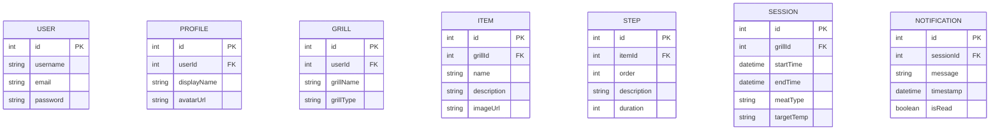

# 🔥 **Grill-Daddy**: The Ultimate BBQ Timer App 🥩

Welcome to **Grill-Daddy**, the next-generation BBQ companion app designed for grilling enthusiasts and professionals alike. Manage your grilling sessions, track food items with custom steps, and never miss the perfect cook again! 🚀

---

## 🌟 **Features**
- 🕒 **Multi-Grill Timers**: Track multiple grill sessions simultaneously.
- 📜 **Customizable Cooking Steps**: Add step-by-step instructions for any food item.
- 📊 **Session History**: Save and analyze past grilling sessions.
- 🎨 **Enhanced Themes**: Personalize your app with beautiful themes and animations.
- 🔔 **Push Notifications**: Get real-time alerts for timers and important steps.
- 🌐 **Cross-Platform**: Use it on web and mobile.

---

## 💻 **Tech Stack**

| **Category**          | **Technology**          | **Why**                                                                                   |
|------------------------|-------------------------|-------------------------------------------------------------------------------------------|
| **Frontend**           | Next.js (React)        | Industry-standard framework with SSR, SSG, and TypeScript support.                       |
| **Styling**            | Tailwind CSS           | Utility-first CSS for rapid prototyping and customization.                               |
| **State Management**   | React Query            | Powerful state management for server-side data.                                          |
| **Backend**            | NestJS (TypeScript)    | Scalable Node.js framework with strong TypeScript support.                               |
| **Database**           | PostgreSQL             | Robust relational database with JSONB support.                                           |
| **ORM**                | Prisma                 | Type-safe database access and migrations.                                                |
| **Authentication**     | NextAuth.js            | Secure, easy-to-integrate authentication for Next.js.                                    |
| **Caching**            | Redis                  | In-memory caching for performance optimization.                                          |
| **DevOps**             | Vercel & PlanetScale   | Serverless deployment for the frontend and backend.                                      |
| **Monitoring**         | Datadog APM            | Application performance monitoring for observability.                                    |
| **Testing**            | Jest & Playwright      | Comprehensive unit and end-to-end testing frameworks.                                    |

---

## 🛠️ **How to Run Locally**

1. **Clone the repository**:
   ```bash
   git clone https://github.com/yourusername/grill-daddy.git
   cd grill-daddy
   ```

2. **Install dependencies**:
   ```bash
   npm install
   ```

3. **Set up the database**:
   - Create a PostgreSQL instance locally or on the cloud.
   - Configure the `DATABASE_URL` in the `.env` file.

4. **Run Prisma migrations**:
   ```bash
   npx prisma migrate dev
   ```

5. **Start the development server**:
   ```bash
   npm run dev
   ```

6. **Access the app**:
   Open [http://localhost:3000](http://localhost:3000) in your browser.

---

## 🗂️ **Project Structure**

```plaintext
grill-daddy/
├── src/
│   ├── auth/           # Authentication logic
│   ├── components/     # Reusable React components
│   ├── pages/          # Next.js pages
│   ├── prisma/         # Prisma schema and migrations
│   ├── services/       # Backend services for business logic
│   ├── utils/          # Helper functions and utilities
│   └── tests/          # Unit and end-to-end tests
├── public/             # Static assets (images, icons)
├── .env                # Environment variables
├── package.json        # Project dependencies
└── README.md           # Project documentation
```

---

## 📊 **Database Schema**

Here’s an overview of the core entities in the project:

```plaintext
User - Profile - Grill - Item - Step - Session - Notification
```

### ERD Diagram:



---

## 🚀 **Roadmap**

### **MVP Completed**
- Multi-grill timer support.
- Basic session tracking.

### **Next Steps**
1. Implement `Item` and `Step` models.
2. Add Redis caching for real-time timer updates.
3. Deploy to production (Vercel & PlanetScale).
4. Set up performance monitoring with Datadog APM.
5. Expand with themes and advanced analytics.
6. User authentication and profiles.

---

## 🌍 **Contributing**

We welcome contributions to **Grill-Daddy**! To get started:
1. Fork the repository.
2. Create a feature branch:
   ```bash
   git checkout -b feature-name
   ```
3. Commit your changes:
   ```bash
   git commit -m "Add feature-name"
   ```
4. Push the branch:
   ```bash
   git push origin feature-name
   ```
5. Submit a Pull Request.

---

## 🔗 **Links**

- **Live Demo**: [Coming Soon](#)
- **Documentation**: [Grill-Daddy Wiki](#)
- **Changelog**: [Release Notes](#)

---

## 🧑‍💻 **Contact**
Developed with ❤️ by [Your Name](https://yourwebsite.com).  
Feel free to reach out via [email@example.com](mailto:email@example.com) or [Twitter](https://twitter.com/yourhandle).

---

## 🎨 **Fun Easter Egg**
Hover over the 🔥 Grill-Daddy logo on the app’s homepage for a surprise animation!
